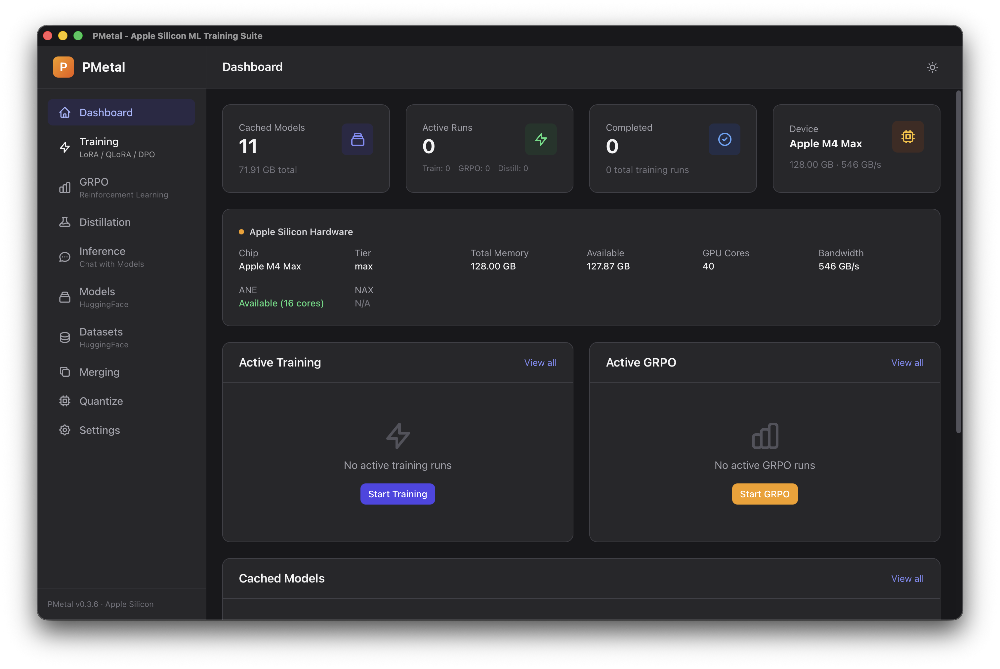
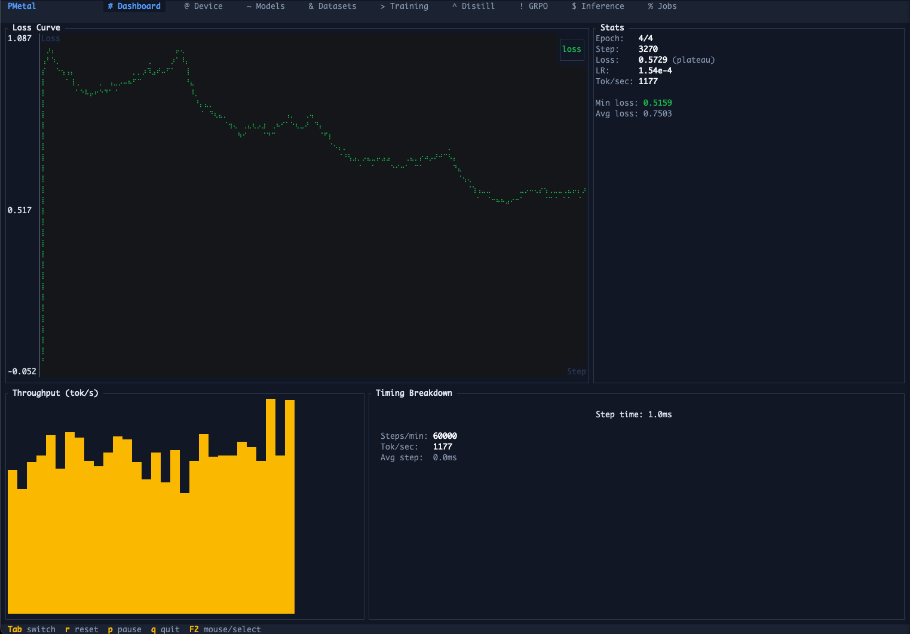

[](https://crates.io/crates/pmetal)
[](https://www.rust-lang.org)
[](LICENSE)
[](https://www.apple.com/macos)

# PMetal

**Powdered Metal** — An ML SDK, framework, and application suite for Apple Silicon, written in Rust.

PMetal is a complete machine learning platform for Apple Silicon — from low-level Metal GPU kernels and Apple Neural Engine integration to high-level training APIs, a terminal TUI, and a full desktop GUI. Ship fine-tuned models without leaving the Apple ecosystem.

## Use PMetal Your Way

### Desktop GUI



A full Tauri + Svelte desktop application for visual model management, training, and inference.

```bash
cd crates/pmetal-gui
bun install && bun tauri dev
```

10 pages: Dashboard, Models, Datasets, Training, Distillation, GRPO, Inference, Merging, Quantize, and Settings. Download models from HuggingFace, configure LoRA training with live loss metrics, chat with models, merge weights, and quantize — all from the GUI. Training runs in-process with real-time progress updates.

### Terminal TUI



A full-featured terminal control center with 9 tabs.

```bash
pmetal tui
```

| Tab | Description |
|-----|-------------|
| **Dashboard** | Live loss curves (braille), LR schedule, throughput sparklines, timing breakdown gauges |
| **Device** | GPU/ANE info, Metal feature detection, memory gauge, kernel tuning, UltraFusion topology |
| **Models** | Browse cached models, HuggingFace Hub search (`S`), memory fit estimation, download |
| **Datasets** | Scan and preview local datasets (JSONL, Parquet, CSV) with line counts |
| **Training** | Configure and launch SFT/LoRA/QLoRA training runs with sectioned parameter forms |
| **Distillation** | Configure knowledge distillation (online, offline, progressive, cross-vocab) |
| **GRPO** | Configure GRPO/DAPO reasoning training with reward functions and sampling params |
| **Inference** | Interactive chat interface with markdown rendering and generation settings sidebar |
| **Jobs** | Training run history with log viewer, status tracking, and metadata |

Keybindings: `Tab`/`Shift+Tab` to switch tabs, `Alt+1-9` for direct access, `L` to adjust learning rate mid-run, `q` to quit.

### CLI

```bash
# LoRA fine-tuning with sequence packing (default)
pmetal train \
  --model Qwen/Qwen3-0.6B \
  --dataset train.jsonl \
  --output ./output \
  --lora-r 16 --batch-size 4 --learning-rate 2e-4

# Inference with LoRA adapter
pmetal infer \
  --model Qwen/Qwen3-0.6B \
  --lora ./output/lora_weights.safetensors \
  --prompt "Explain quantum entanglement" \
  --chat --show-thinking

# Knowledge distillation
pmetal distill \
  --teacher Qwen/Qwen3-4B \
  --student unsloth/Qwen3.5-0.8B-Base \
  --dataset train.jsonl

# GRPO reasoning training
pmetal grpo \
  --model Qwen/Qwen3-0.6B \
  --dataset reasoning.jsonl \
  --reasoning-rewards

# HuggingFace model search with memory fit
pmetal search "qwen 0.6b" --detailed
```

## SDK

PMetal is an embeddable SDK — integrate training, inference, and model operations into your own Rust applications. The `easy` module provides high-level builders, while the underlying crates (`pmetal-trainer`, `pmetal-models`, `pmetal-lora`, etc.) offer full control over every pipeline stage.

```rust
use pmetal::easy;

// Fine-tune with LoRA
let result = easy::finetune("Qwen/Qwen3-0.6B", "train.jsonl")
    .lora(16, 32.0)
    .learning_rate(2e-4)
    .epochs(3)
    .run()
    .await?;

// DPO preference optimization
let result = easy::dpo("Qwen/Qwen3-0.6B", "preferences.jsonl")
    .dpo_beta(0.1)
    .reference_model("Qwen/Qwen3-0.6B")
    .run()
    .await?;

// Inference
let output = easy::infer("Qwen/Qwen3-0.6B")
    .temperature(0.7)
    .lora("./output/lora_weights.safetensors")
    .generate("What is 2+2?")
    .await?;

// Streaming inference
easy::infer("Qwen/Qwen3-0.6B")
    .generate_streaming("Tell me a story", |delta| {
        print!("{delta}");
        true // return false to stop early
    })
    .await?;
```

Available builders: `easy::finetune()`, `easy::dpo()`, `easy::simpo()`, `easy::orpo()`, `easy::kto()`, `easy::infer()`.

For lower-level control, use the crates directly — `pmetal-trainer::TrainingLoop`, `pmetal-models::DynamicModel`, `pmetal-lora::DynamicLoraModel`, `pmetal-distill::Distiller`, etc.

## Python SDK

```python
import pmetal

# Fine-tune
trainer = pmetal.Trainer(
    model="Qwen/Qwen3-0.6B",
    dataset="train.jsonl",
    lora_r=16,
    learning_rate=2e-4,
)
trainer.add_callback(pmetal.ProgressCallback())
trainer.train()

# Inference
model = pmetal.load("Qwen/Qwen3-0.6B")
print(model.generate("Hello world"))
```

## Installation

Prebuilt signed binaries are available on the [Releases](https://github.com/Epistates/pmetal/releases) page.

Crates are available on [crates.io](https://crates.io/crates/pmetal).

Build from source:

```bash
git clone https://github.com/epistates/pmetal.git && cd pmetal
cargo build --release          # CLI + TUI
cd crates/pmetal-gui && bun install && bun tauri build  # GUI (optional)
```

## Hardware Support

PMetal automatically detects Apple Silicon capabilities at startup and tunes kernel parameters accordingly.

| Chip Family | GPU Family | NAX | ANE | UltraFusion | Status |
|-------------|-----------|-----|-----|-------------|--------|
| M1 / Pro / Max / Ultra | Apple7 | - | 16 cores | Ultra: 2-die | Fully supported |
| M2 / Pro / Max / Ultra | Apple8 | - | 16 cores | Ultra: 2-die | Fully supported |
| M3 / Pro / Max / Ultra | Apple9 | - | 16 cores | Ultra: 2-die | Fully supported |
| M4 / Pro / Max / Ultra | Apple9 | - | 16 cores | Ultra: 2-die | Fully supported |
| **M5 / Pro / Max / Ultra** | **Apple10** | **Yes** | **16 cores** | **Ultra: 2-die** | **Fully supported** |

**Auto-detected features**: GPU family, device tier, core counts, memory bandwidth, dynamic caching, mesh shaders, NAX (M5+), UltraFusion topology (via `sysctl hw.packages`), ANE availability.

**Tier-based kernel tuning**: Matrix tile sizes, FlashAttention block sizes, fused kernel threadgroup sizes, and batch multipliers are automatically selected based on device tier (Base/Pro/Max/Ultra) and GPU family. See [`docs/hardware-support.md`](docs/hardware-support.md) for the full tuning matrix.

## Architecture

PMetal is organized as a Rust workspace with 17 specialized crates:

```
pmetal/
├── pmetal-core         # Foundation: configs, traits, types, error handling
├── pmetal-metal        # Custom Metal GPU kernels + ANE runtime
├── pmetal-mlx          # MLX backend integration (KV cache, RoPE, etc.)
├── pmetal-models       # LLM architectures (Llama, Qwen, DeepSeek, etc.)
├── pmetal-lora         # LoRA/QLoRA training implementations
├── pmetal-trainer      # Training loops (SFT, DPO, SimPO, ORPO, KTO, GRPO)
├── pmetal-data         # Dataset loading, chat templates, tokenization
├── pmetal-hub          # HuggingFace Hub integration + model fit estimation
├── pmetal-distill      # Knowledge distillation (online, offline, cross-vocab)
├── pmetal-merge        # Model merging (Linear, SLERP, TIES, DARE, ModelStock)
├── pmetal-gguf         # GGUF format with imatrix quantization
├── pmetal-mhc          # Manifold-Constrained Hyper-Connections
├── pmetal-distributed  # Distributed training (mDNS, Ring All-Reduce)
├── pmetal-vocoder      # BigVGAN neural vocoder
├── pmetal-py           # Python bindings (maturin/PyO3)
├── pmetal-cli          # Command-line interface + TUI control center
└── pmetal-gui          # Desktop GUI (Tauri + Svelte + TailwindCSS)
```

The `pmetal` facade crate re-exports all modules with feature flags and provides the `easy` API for quick-start usage.

## Supported Models

| Family | Variants | LoRA | QLoRA | Full FT |
|--------|----------|------|-------|---------|
| Llama | 2, 3, 3.1, 3.2, 3.3 | ✓ | ✓ | ✓ |
| Llama 4 | Scout, Maverick | ✓ | - | ✓ |
| Qwen | 2, 2.5, 3, 3.5 (Next) | ✓ | ✓ | ✓ |
| Qwen MoE | 3-MoE | ✓ | - | ✓ |
| DeepSeek | V3, V3.2, V3.2-Speciale | ✓ | - | ✓ |
| Mistral | 7B, 8x7B | ✓ | ✓ | ✓ |
| Gemma | 2, 3 | ✓ | - | ✓ |
| Phi | 3, 4 | ✓ | - | ✓ |
| Cohere | Command R | ✓ | - | ✓ |
| Granite | 3.0, 3.1 | ✓ | - | ✓ |
| NemotronH | Hybrid (Mamba+Attention) | ✓ | - | ✓ |
| StarCoder2 | 3B, 7B, 15B | ✓ | - | ✓ |
| RecurrentGemma | Griffin | ✓ | - | ✓ |
| Jamba | 1.5 | ✓ | - | ✓ |
| GPT-OSS | 20B, 120B | ✓ | - | - |

### Vision & Multimodal Models (In Progress)

| Family | Variants | Status |
|--------|----------|--------|
| Pixtral | 12B | Architecture implemented |
| Qwen2-VL | 2B, 7B | Architecture implemented |
| MLlama | 3.2-Vision | Architecture implemented |
| CLIP | ViT-L/14 | Architecture implemented |
| Whisper | Base, Small, Medium, Large | Architecture implemented |

### Diffusion Models

| Family | Variants | Status |
|--------|----------|--------|
| Flux | 1-dev, 1-schnell | Dispatcher + pipeline implemented |

## Training Methods

All training methods support callback-based cancellation (`should_stop()`), metrics JSONL logging, and adaptive learning rate control.

| Method | CLI | GUI | TUI | Library |
|--------|-----|-----|-----|---------|
| SFT (Supervised Fine-Tuning) | `train` | ✓ | ✓ | `easy::finetune()` |
| LoRA | `train` | ✓ | ✓ | `easy::finetune()` |
| QLoRA (4-bit) | `train --quantization nf4` | ✓ | ✓ | `easy::finetune()` |
| DPO (Direct Preference) | `train --method dpo` | - | ✓ | `easy::dpo()` |
| SimPO (Simple Preference) | `train --method simpo` | - | ✓ | `easy::simpo()` |
| ORPO (Odds-Ratio Preference) | `train --method orpo` | - | ✓ | `easy::orpo()` |
| KTO (Kahneman-Tversky) | `train --method kto` | - | ✓ | `easy::kto()` |
| GRPO (Reasoning) | `grpo` | ✓ | ✓ | library |
| DAPO (Decoupled GRPO) | `grpo --dapo` | ✓ | ✓ | library |
| Knowledge Distillation | `distill` | ✓ | ✓ | library |
| ANE Training | `train` (auto) | - | ✓ | library |
| DoRA | `train --dora` | ✓ | ✓ | `easy::finetune()` |

Additional methods available via the library: GSPO, PPO, Online DPO, Diffusion Training.

## Key Features

### Metal GPU Optimizations

Custom Metal shaders provide significant speedups:

- **FlashAttention**: O(n) memory attention with fused softmax, tier-aware block sizes
- **Fused GDN**: Gated Delta Network recurrence kernel (ported from FLA Triton) — single-pass state update with SIMD reductions
- **Fused LoRA**: Combined forward pass for adapter layers
- **Fused Cross-Entropy**: Unsloth-style chunked loss computation
- **Fused RoPE**: Rotary position embeddings in-kernel
- **Fused SwiGLU**: Fused gate + activation with tier-tuned threadgroups
- **Fused RMSNorm + LoRA**: Combined normalization and adapter projection
- **Fused Sampler**: JIT-compiled token sampling

### ANE (Neural Engine) Pipeline

Native ANE integration for power-efficient training and inference:

- **Dynamic Weight Pipeline**: 9 MIL kernels compiled once at startup; weights packed alongside activations in IOSurface spatial dimension
- **Hybrid Inference**: ANE prefill + CPU decode with KV cache. Power-of-2 sequence bucketing for optimal kernel compilation
- **CPU RMSNorm**: RMSNorm computed in f32 on CPU to avoid fp16 overflow on ANE (saturation arithmetic)
- **IOSurface Zero-Copy**: fp32 shared memory surfaces for CPU↔ANE data transfer with no serialization overhead
- **M1–M5 Compatibility**: Per-matrix weight blobs for M1, single-blob for M3+. CPU FFN fallback for 4B+ models

### Training Infrastructure

- **Sequence Packing**: Efficiently pack multiple sequences into single batches for 2-5x throughput. Enabled by default
- **Gradient Checkpointing**: Trade compute for memory on large models with configurable layer grouping
- **Adaptive LR**: EMA-based anomaly detection with spike recovery, plateau reduction, and divergence detection
- **Callback System**: `TrainingCallback` trait with lifecycle hooks (`on_step_start`, `on_step_end`, `should_stop`) for metrics logging, progress reporting, and clean cancellation
- **Checkpoint Management**: Save and resume training from checkpoints with best-loss rollback
- **Tool/Function Calling**: Chat templates with native tool definitions for Qwen, Llama 3.1+, Mistral v3+, and DeepSeek

### Dataset Formats

Auto-detected training data formats:

- **ShareGPT**: `{"conversations": [{"from": "human", "value": "..."}, ...]}`
- **Alpaca**: `{"instruction": "...", "input": "...", "output": "..."}`
- **OpenAI/Messages**: `{"messages": [{"role": "user", "content": "..."}, ...]}`
- **Reasoning**: `{"problem": "...", "thinking": "...", "solution": "..."}`
- **Simple**: `{"text": "..."}`
- **Parquet**: Supports both standard text columns and reasoning formats

### Model Operations

- **HuggingFace Hub Search**: `pmetal search` with memory fit estimation and download
- **Model Merging**: Linear, SLERP, TIES, DARE, ModelStock strategies
- **LoRA Fusing**: Merge LoRA adapters into base weights for deployment
- **GGUF Quantization**: Q8_0, Q4_K_M, dynamic quantization with imatrix support
- **FP8 Runtime Quantization**: Convert to FP8 (E4M3) at inference time for ~2x memory reduction

## Configuration

### `pmetal train` Parameters

| Parameter | Default | Description |
|-----------|---------|-------------|
| `--lora-r` | 16 | LoRA rank |
| `--lora-alpha` | 32.0 | LoRA scaling factor (2x rank) |
| `--batch-size` | 1 | Micro-batch size |
| `--learning-rate` | 2e-4 | Learning rate |
| `--max-seq-len` | 0 | Max seq len (0 = auto-detect) |
| `--epochs` | 1 | Number of training epochs |
| `--max-grad-norm` | 1.0 | Gradient clipping |
| `--quantization` | none | QLoRA method (nf4, fp4, int8) |
| `--gradient-accumulation-steps` | 4 | Gradient accumulation steps |
| `--no-ane` | false | Disable ANE training |
| `--embedding-lr` | None | Separate LR for embeddings |
| `--no-metal-fused-optimizer` | false | Disable Metal fused optimizer |
| `--rslora` | false | Rank-stabilized LoRA |
| `--dora` | false | Weight-decomposed LoRA |

### `pmetal infer` Parameters

| Parameter | Default | Description |
|-----------|---------|-------------|
| `--temperature` | Model default | Sampling temperature |
| `--top-k` | Model default | Top-k sampling |
| `--top-p` | Model default | Nucleus sampling |
| `--min-p` | Model default | Min-p dynamic sampling |
| `--max-tokens` | 256 | Maximum generation length |
| `--repetition-penalty`| 1.0 | Repetition penalty |
| `--chat` | false | Apply chat template |
| `--show-thinking` | false | Show reasoning content |
| `--fp8` | false | Use FP8 weights (~2x mem reduction) |
| `--compiled` | false | Use JIT-compiled sampling |
| `--no-ane` | false | Disable ANE inference |
| `--ane-max-seq-len` | 1024 | Max ANE kernel sequence length |

## Development

### Building

```bash
# Release build (default features: ANE + Dashboard)
cargo build --release

# Build without ANE
cargo build --release --no-default-features --features dashboard

# Run tests (single-threaded for Metal compatibility)
just test

# Build GUI
cd crates/pmetal-gui && bun install && bun tauri build
```

### Formal Verification

```bash
# cargo-kani proofs for ring all-reduce and topology
just kani-verify
```

## License

Licensed under either of MIT or Apache-2.0.

## Acknowledgments

- [MLX](https://github.com/ml-explore/mlx) - Apple's machine learning framework
- [mlx-rs](https://github.com/oxideai/mlx-rs) - Rust bindings for MLX
- [Unsloth](https://github.com/unslothai/unsloth) - Inspiration for fused kernels
- [Tauri](https://tauri.app) - Desktop application framework
